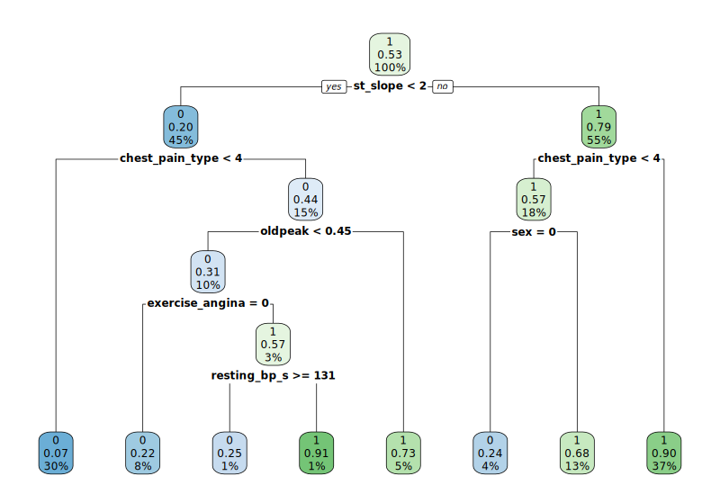
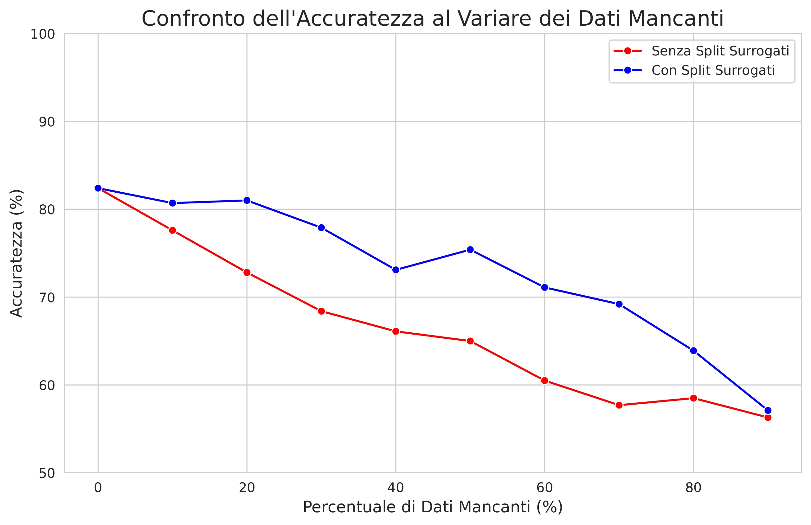
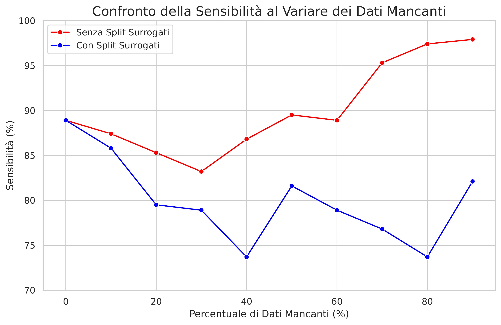
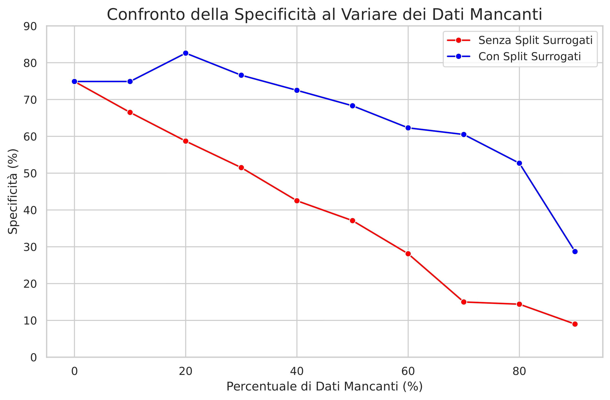

<div align="center">
    
    <h2>Gestione dei dati mancanti in Machine Learning: applicazione a dati clinici per la diagnosi di patologie cardiache</h2>
    <h4>Missing Data Management in Machine Learning: Application to Clinical Data for Cardiovascular Disease Diagnosis</h4>
</div>
<br>

# Introduction

Machine Learning (ML) offers powerful tools for extracting valuable insights from complex clinical datasets. In cardiology, the application of these methods promises to significantly improve the early detection of heart disease. Supervised ML models, however, need to be trained on large amounts of data, and medical datasets are almost always affected by the **missing data problem**, caused by tests not performed, measurement errors, or accidental loss of information. Handling missing data is therefore a critical step in any clinical ML pipeline.

This thesis directly addresses this challenge, focusing on the evaluation of effective strategies for managing incomplete data in the specific context of heart disease diagnosis. In particular, it analyses a technique native to **decision tree models: surrogate splits**. Unlike imputation methods, which attempt to estimate and fill in missing values, this mechanism allows the decision algorithm to handle the absence of a value at prediction time, leveraging correlated alternative variables to make a robust decision.

# Dataset

To investigate the effectiveness of this approach, an experimental study was conducted using the <b>UCI Heart Disease</b> clinical dataset. 
The original dataset employed in this study is available at [<b>UCI Heart Disease</b>](https://raw.githubusercontent.com/rikhuijzer/heart-disease-dataset/main/heart-disease-dataset.csv).

| Variable | Description |
|----------|-------------|
| `age` | Patient's age in years. |
| `sex` | Patient's sex (1 = male, 0 = female). |
| `chest_pain_type` | Type of chest pain. Includes four categories indicating different types of chest pain associated with cardiac problems. Typical angina corresponds to the classic pain caused by reduced blood flow to the heart, often triggered by physical exertion and relieved by rest. Atypical angina is less characteristic, with variable intensity and location, not necessarily linked to physical activity. Non-anginal pain stems from non-cardiac causes, such as musculoskeletal or digestive problems, while the asymptomatic category indicates the absence of perceived pain, even though a cardiac problem may still be detectable through clinical tests. |
| `resting_bp_s` | Resting blood pressure measured in millimeters of mercury (mm Hg). |
| `cholesterol` | Serum cholesterol measured in mg/dl. Higher levels may indicate greater cardiovascular risk. |
| `fasting_blood_sugar` | Fasting blood sugar > 120 mg/dl (1 = true, 0 = false). A high value may be associated with diabetes. |
| `resting_ecg` | Results of the resting electrocardiogram. Signals possible abnormalities in the heart's electrical activity, such as changes in the ST‑T segment, which may indicate reduced blood flow to the heart, or thickening of the ventricular walls, meaning the heart is working harder than normal. |
| `max_heart_rate` | Maximum heart rate achieved by the patient during physical exertion. |
| `exercise_angina` | Presence of exercise-induced angina (1 = yes, 0 = no). Exertional angina is chest pain or discomfort caused by physical activity. |
| `oldpeak` | ST depression induced by exercise relative to rest. Indicates how much the ST segment drops during exertion, a sign of ischemia (reduced blood flow to the heart). |
| `st_slope` | Slope of the ST segment at peak exercise. Categorical variable (up, flat, down) reflecting the electrical response to stress. |
| `target` | Heart disease diagnosis (1 = present, 0 = absent). |

> The dataset contains **1,190 rows**. The distribution between healthy and diseased patients is fairly balanced, with **499** individuals without heart disease (target = 0) and **526** with heart disease (target = 1).

# Methodology

The experimental protocol simulates realistic scenarios of incomplete clinical data. Increasing levels of **MCAR** missing values (10% → 90%) are introduced, and at each level, two models are compared:

| Model | Missing data strategy |
|-------|-----------------------|
| ✅ **With surrogate splits** | Uses correlated alternative variables to route observations when a value is missing |
| ❌ **Without surrogate splits** | Routes observations to the most frequent branch of the node |

Performance is measured on a held-out **Test Set (30%)** using three metrics: **Accuracy**, **Sensitivity**, and **Specificity**, chosen to capture both overall performance and the clinical cost of false negatives vs. false positives.

# Results

The experiment was conducted across ten missing data scenarios, from 0% to 90%, comparing a standard decision tree against one using surrogate splits. All models were evaluated on a held-out Test Set using Accuracy, Sensitivity, and Specificity.

---

### Baseline (0% missing data)

The baseline model, trained on the complete dataset, achieved **82.4% accuracy** (Sensitivity: 88.9%, Specificity: 74.9%). This represents the upper bound against which all incomplete-data scenarios are measured.

The most important feature identified by the model is `st_slope`, used as the root split, a clinically meaningful finding, as the ST segment slope is a well-known indicator of myocardial ischemia. Other relevant features include `chest_pain_type`, `sex`, and `oldpeak`. Since surrogate splits are only triggered in the presence of missing values, both configurations yield identical results on a complete dataset. The baseline model was therefore trained without surrogate splits. This is the output decision tree:

<div align="center">
    
</div>

---

### How Surrogate Splits Work in Practice

When the primary split variable (`st_slope`) is missing, the model does not give up, it falls back to a ranked list of correlated surrogate variables. For example, at 10% missing data, the surrogate hierarchy for the root node is:

| Surrogate Rule | Direction | Agreement |
|----------------|-----------|-----------|
| `oldpeak < 0.95` | left | 77.5% |
| `exercise_angina < 0.5` | left | 70.3% |
| `max_heart_rate < 150.5` | right | 69.5% |
| `chest_pain_type < 3.5` | left | 68.0% |
| `age < 51.5` | left | 62.4% |

This hierarchy is computed for every node in the tree, ensuring robust decision-making at every step even when data is incomplete.

---

### Performance Degradation Under Missing Data

As the percentage of missing values increases, the two models diverge sharply:

| % Missing | Accuracy (no surrogates) | Accuracy (with surrogates) | Δ |
|:---------:|:------------------------:|:--------------------------:|:-:|
| 0%        | 82.4%                    | 82.4%                      | — |
| 10%       | 77.6%                    | 80.7%                      | **+3.1%** |
| 20%       | 72.8%                    | 81.0%                      | **+8.2%** |
| 30%       | 68.4%                    | 77.9%                      | **+9.5%** |
| 50%       | 65.0%                    | 75.4%                      | **+10.4%** |
| 70%       | 57.7%                    | 69.2%                      | **+11.5%** |
| 90%       | 56.3%                    | 57.1%                      | +0.8% |

<br>
<div align="center">
    
</div>

---

### The Specificity Collapse

The most critical finding goes beyond accuracy. The model **without** surrogate splits does not simply become less accurate, it **collapses**. As missing data grows, it increasingly defaults to classifying every patient as "diseased", artificially inflating sensitivity to ~98% while specificity crashes to **below 10%** at 90% missing data. A model with 10% specificity is clinically useless: it would subject nearly every healthy patient to unnecessary further examinations and treatments.
<br>
<div align="center">
    
</div>
<br>
<div align="center">
    
</div>

# Conclusions

The results of this study demonstrate that surrogate splits are not merely an optional enhancement for binary classification problems with MCAR missing data, they are a **necessity**.

Without surrogate splits, the model does not degrade gracefully. Instead, it undergoes a silent collapse: as missing data increases, it progressively defaults to classifying the majority of patients as "diseased", artificially inflating sensitivity while specificity crashes. **This behaviour is particularly insidious because the model continues to produce predictions without raising any errors, making the failure invisible unless sensitivity and specificity are explicitly monitored alongside accuracy.**

Critically, this failure is not limited to extreme missing data scenarios. Significant model collapse was already observed at **20%, 30% and 40%** missing values, percentages that are far from unusual in real-world clinical datasets.

Surrogate splits directly prevent this by providing the decision tree with a hierarchical fallback strategy: when a primary variable is missing, the algorithm automatically relies on the most correlated available alternative, preserving the model's ability to discriminate between healthy and diseased patients in a balanced and clinically meaningful way.

# Future Work

This study has some limitations, including the use of a single dataset, the generation of missing data under a purely random mechanism (MCAR), and the execution of a single simulation per scenario. Future developments could include:

- Validating these results on additional clinical datasets
- A direct performance comparison with advanced imputation methods such as MICE
- Running multiple simulations per scenario to obtain more robust performance estimates
- Extending the analysis to Random Forest models, which combine multiple decision trees simultaneously and represent a natural evolution of the approach studied here

# Requirements & Setup

The experiments are implemented in **Python**, leveraging the `rpart` package from **R** for decision tree construction with surrogate splits, a feature not natively supported by Python's `scikit-learn`. The R code is executed directly from Python via the `rpy2` bridge.

## Prerequisites

- Python 3.x
- R

> ⚠️ **Note:** The experiments were developed and tested on **Ubuntu**, running the script on Ubuntu is recommended to ensure compatibility.

## Installation

**Python dependencies:**
```bash
pip install pandas numpy rpy2 matplotlib
```

**R dependencies** (run inside an R session):
```r
install.packages("rpart")
install.packages("rpart.plot")
```

## Running the Experiments
```bash
# Run the full experiment pipeline
python src/scriptPython.py

# Generate comparison plots
python src/creazioneGrafici.py
```

# Citation

If you use this project, please consider citing:  
```
@thesis{rizzo2026,
  author  = {Lorenzo Rizzo},
  title   = {Gestione dei dati mancanti in Machine Learning: applicazione a dati clinici per la diagnosi di patologie cardiache},
  year    = {2026},
  school  = {Università del salento},
  type    = {Bachelor's Thesis}
}
```
